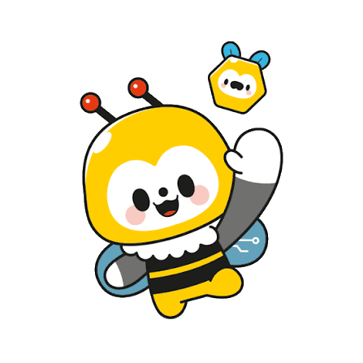
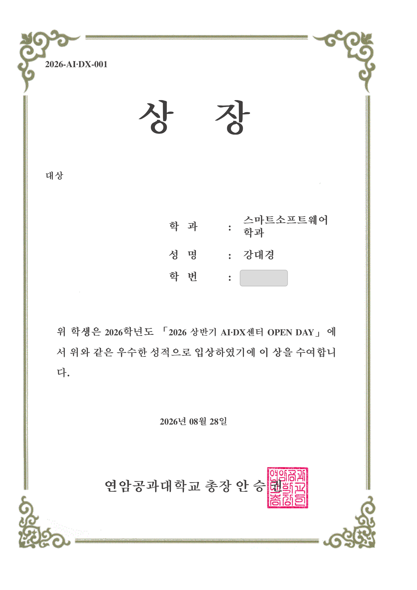
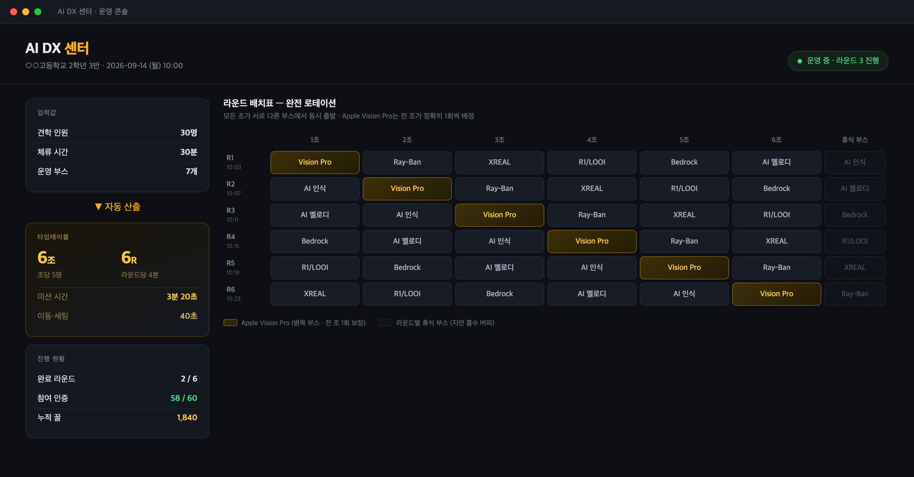
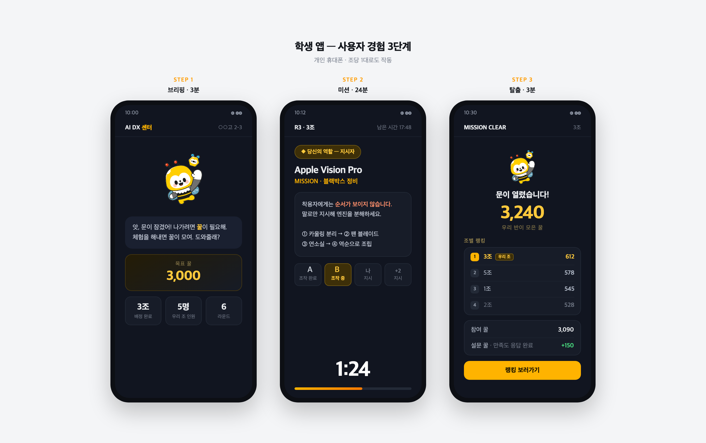
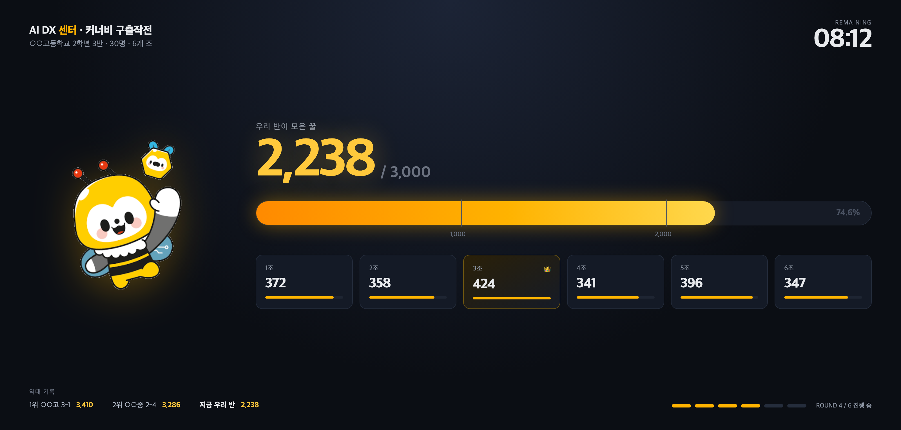
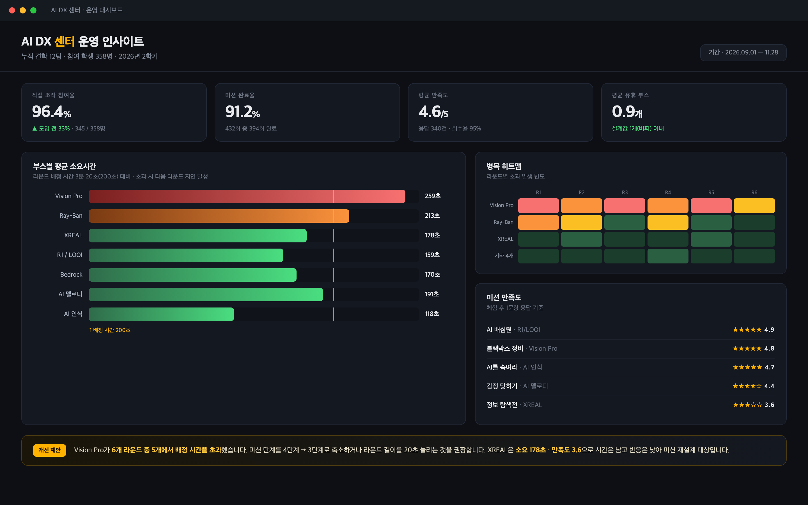

# AI DX센터 커너비 구출작전

<sub>AI DX CREW Experience Mission</sub>

> **"구경하러 온 29명을, 참여자로."**
>
> 연암공과대학교 AI DX 센터 견학 프로그램을 **협동 구출 미션으로 재설계**한 체험 운영 시스템 기획안.
> 2026 상반기 AI·DX센터 OPEN DAY **대상 수상작**.

<p align="center">
  
</p>

<p align="center">
  <a href="https://kdg-04.github.io/2026-OPEN-DAY/"><b>프로젝트 페이지</b></a>
  &nbsp;·&nbsp;
  <a href="https://kdg-04.github.io/2026-OPEN-DAY/presentation/slides.html">발표 슬라이드</a>
  &nbsp;·&nbsp;
  <a href="https://kdg-04.github.io/2026-OPEN-DAY/presentation/book.html">화면 북클릿</a>
</p>

| | |
|---|---|
| **프로젝트명** | AI DX센터 커너비 구출작전 |
| **행사** | 「2026 상반기 AI·DX센터 OPEN DAY」 · 연암공과대학교 |
| **일자** | 2026년 8월 28일 |
| **결과** | 🏆 **대상** · 상장번호 2026-AI·DX-001 |
| **팀** | Team 23 |
| **팀장** | 강대경 — 문제 제기(AI CREW 현장 근무), 스토리텔링 설계, 시스템 구조, 발표 |
| **팀원** | 이0혜 — 방탈출 컨셉 제안 |
| **팀원** | 조0영 — 스탬프/리워드 시스템 제안 |
| **산출물** | 기획 + 프로토타입 화면 4종 (실서비스 개발 전 단계) |

<p align="center">
  
</p>

### 바로 보기

| | |
|---|---|
| 🎞 **발표 슬라이드** | [슬라이드 보기](https://kdg-04.github.io/2026-OPEN-DAY/presentation/slides.html) — 12장 |
| 📄 **MVP 정의서** | [PDF 열기](docs/AI-DX센터-커너비-구출작전-MVP.pdf) — 실제 개발 범위 정의 |
| 🖼 **프로토타입** | [화면 4종 보기](#4-프로토타입-화면) |

> 📌 발표 원본(PPT · PDF)은 유실되었습니다. **원본 그대로 남은 자료는 목업 4종뿐**이며,
> 슬라이드는 복원본, 문서는 이후 작성본입니다. → [자세한 내용](#7-현재-상태)

---

## 1. 문제

AI DX 센터는 1층에 10개 내외의 체험존을 운영하고, 중·고등학생 단체 견학, 대학생, 교환학생 등 다양한 방문객을 받는다.
팀장 강대경이 **AI CREW(체험 안내 요원)로 실제 현장에서 근무하며** 반복적으로 관측하고 팀에 제기한 문제는 두 가지였다.

**① 체험이 특정 부스로 쏠린다**
Apple Vision Pro 같은 인기 부스 앞에는 줄이 길어지고, 그동안 다른 부스는 비어 있다.
센터가 준비한 다양한 기술을 방문객 대부분이 경험하지 못한 채 돌아간다.

**② 조에서 한 명만 체험하고 나머지는 구경한다**
5명이 함께 부스에 들어가도 기기를 잡는 사람은 보통 한 명이다.
"체험했다"는 기록은 5명분이지만 실제 참여는 1명분이다.

> 센터의 목표는 *"많은 사람이 다양한 체험을 하는 것"*인데,
> 현장은 *"몇 사람이 인기 체험만 하는 것"*에 가까웠다.

---

## 2. 아이디어 발전 과정

```
[강대경] 문제 제기 — AI CREW 현장 근무 중 관측
        ↓
[조0영] 듀오링고식 스탬프·점수 시스템
        ↓
   ✗ 방문객이 1회성이라 누적형 동기가 작동하지 않음
        ↓
[이0혜] 방탈출을 접목하자
        ↓
   ✓ 하루의 방문 자체를 하나의 완결된 게임으로
        ↓
[강대경] 커너비(교내 마스코트) 스토리텔링 + 시스템 설계
        "커너비가 위험에 빠졌다.
         체험으로 꿀을 모아 커너비를 구하자."
        ↓
조 편성 · 완전 로테이션 · 역할 분리 · 꿀 게이지 · 운영 대시보드
```

**핵심 전환점**은 "스탬프를 준다"에서 **"체험하지 않으면 나갈 수 없다"**로 목표를 바꾼 것이다.
보상을 늘리는 대신 **게임의 승리 조건 자체를 다양한 체험으로 정의**했다.

---

## 3. 해결 방식

### 3-1. 스토리텔링 — 커너비 구출작전

교내 마스코트 **커너비가 위험에 빠졌다.**
커너비를 구하려면 **꿀(HONEY)**이 필요하고, 꿀은 체험존의 미션을 해결해야 모인다.
반 전체가 목표 꿀에 도달하면 커너비를 구해낸다.

**왜 "가두는" 이야기가 아니라 "구하는" 이야기인가**

방탈출 구조를 그대로 가져오면 "커너비가 화가 나서 너희를 가뒀다"가 자연스럽다.
하지만 그 설정에는 세 가지 문제가 있었다.

| 가두는 설정 | 구하는 설정 |
|---|---|
| 학교 마스코트가 **방문객의 적**이 된다 | 커너비가 **함께 지켜야 할 대상**이 된다 |
| 체험이 **벌칙**처럼 읽힌다 | 체험이 **도움을 주는 행동**이 된다 |
| "빨리 나가고 싶다"가 목표 | "끝까지 해내고 싶다"가 목표 |

방탈출에서 가져온 것은 **정서가 아니라 구조**다.
제한 시간, 단계별 미션, 팀 협동, 명확한 목표치 — 이 골격은 유지하되 동기를 반대로 뒤집었다.
쫓겨나기 위해 체험하는 것이 아니라, **구하기 위해 체험한다.**

리워드 단위를 점수가 아닌 **꿀**로 둔 이유도 같다. 커너비에게 필요한 것이 꿀이므로,
"점수 획득"이 곧 **"커너비를 구하는 행동"**으로 읽힌다.

### 3-2. 완전 로테이션 — 쏠림을 구조로 제거

인기 부스에 줄 서지 말라고 안내하는 대신, **애초에 줄이 생기지 않는 배치표를 자동 생성**한다.

- 인원 · 체류시간 · 부스 수를 입력하면 조 편성과 타임테이블이 산식으로 도출된다
- 순환 라틴방격 배치로 **모든 조가 모든 부스를 정확히 1회씩** 경험한다
- 매 라운드 부스 1개를 의도적으로 비워 **지연 흡수 버퍼**로 쓴다

> 30명 / 30분 / 7부스 → **6조 × 5명, 6라운드 × 4분** (미션 3분 20초 + 이동·세팅 40초)

### 3-3. 역할 분리 — 조원 전원을 참여시키는 장치

이 프로젝트에서 가장 차별화된 설계다.
기기가 1대뿐이어도 5명이 모두 참여하도록 **미션을 역할로 쪼갠다.**

| 역할 | 상태 |
|---|---|
| **조작자** | 기기를 착용/조작한다. 단, **미션 절차가 보이지 않는다** |
| **지시자** | 절차를 알고 있다. 단, **조작자의 화면이 보이지 않는다** |

조작자는 지시 없이 아무것도 할 수 없고, 지시자는 말하지 않으면 미션이 진행되지 않는다.
**1인용 기기를 5인용 협동 미션으로 바꾸는 규칙**이다.

여기에 라운드마다 조작자가 교대되어 **6라운드 ÷ 5명 = 전원 최소 1회 직접 조작**이 보장된다.

그리고 **꿀은 참여도에 따라 차등 배분한다.**
조가 모은 꿀을 조원이 똑같이 나눠 갖는 구조라면, 뒤에서 구경만 해도 같은 점수를 받는다.
역할 분리로 만들어 둔 참여 유인이 점수 단계에서 다시 무너지는 것이다.
그래서 직접 조작한 횟수와 미션 기여가 **개인 꿀에 반영되도록** 방향을 잡았다.

> ⚠️ **[확인 필요]** 차등 배분의 **의도와 방향은 기획 단계에서 정했으나, 정확한 산식은 발표 당시 확정하지 못했다.**

### 3-4. 경쟁과 협력의 이중 구조

- **조별 순위** — 조 단위 경쟁으로 몰입을 만든다
- **반 전체 꿀 게이지** — 목표는 반 전체가 함께 넘는다. 다른 조가 잘해도 손해가 아니다
- **역대 반 기록** — 오늘 모은 꿀이 다음 견학 팀의 도전 대상으로 남는다. 1회성 방문객에게 "기록을 남기고 간다"는 동기를 준다
- **실패 없음** — 게이지는 달성 여부가 아니라 총량을 보여준다. **커너비는 반드시 구해낸다.** 미달로 인한 부정적 경험을 설계에서 배제했다

### 3-5. 만족도 조사 — 게이팅이 아닌 보너스

센터가 늘 회수에 어려움을 겪던 만족도 조사를 결과 화면에 붙였다.
응답하면 **설문 꿀**이 추가 지급되지만, 응답하지 않아도 커너비는 구할 수 있다.
강제하지 않으면서 회수율을 끌어올리는 방식이다.

---

## 4. 프로토타입 화면

### SCREEN 01 · 운영자 — 조 편성 & 라운드 타임테이블


입력값(인원 · 체류시간 · 부스 수)만 넣으면 조 편성표와 라운드 배치표가 자동 생성된다.
Apple Vision Pro(병목 부스)는 대각선으로 배치되어 전 조가 1회씩 배정되고, 점선 칸은 라운드별 휴식 부스(버퍼)다.

### SCREEN 02 · 학생 — 사용자 경험 3단계


**브리핑 → 미션 → 구출.**
개인 휴대폰으로 접속하며 조당 1대로도 작동한다.
미션 화면에는 자신의 역할(조작자/지시자)과 조원별 조작 상태가 표시되고, 결과 화면에서 조별 랭킹과 설문 꿀을 확인한다.

### SCREEN 03 · 메인 스테이지 — 꿀 게이지 & 반 기록


센터 입구 대형 화면. 6개 조의 꿀이 하나의 게이지로 합쳐지고, 하단에 역대 반 기록이 노출된다.
체험 결과가 실시간으로 공개되며 현장의 몰입도를 만든다.

### SCREEN 04 · 운영자 — 운영 인사이트 대시보드


게임 데이터가 그대로 **센터 운영 데이터**가 된다.

- **병목 진단** — Vision Pro가 6라운드 중 5라운드에서 배정 시간 초과 → 미션 단계 축소 제안
- **콘텐츠 개선** — XREAL은 시간이 남는데 만족도 3.6 → 미션 재설계 대상으로 자동 식별
- **선순환** — 체험 → 참여 데이터 → 콘텐츠 개선 → 다음 시즌 미션 반영

> ⚠️ 대시보드에 표시된 수치는 **발표용 시나리오 데이터**이며 실측값이 아니다.

---

## 5. 이 아이디어의 핵심

| 기존 견학 | AI DX CREW |
|---|---|
| 인기 부스에 쏠린다 | 완전 로테이션으로 **전 부스 1회씩 보장** |
| 조에서 한 명만 조작한다 | 역할 분리로 **전원 최소 1회 직접 조작** |
| 1회성 방문이라 동기가 없다 | **반 기록**으로 다음 팀에게 남는다 |
| 만족도 조사 회수율이 낮다 | **설문 꿀** 보너스로 자발적 응답 유도 |
| 운영 판단이 감에 의존한다 | **소요시간·병목·만족도 데이터**로 개선 |

**하나의 목표:** *모든 방문객이 다양한 체험에 실제로 참여하게 만든다.*

---

## 6. 저장소 구성

```
OPEN DAY/
├── README.md                 이 문서
├── index.html                GitHub Pages 랜딩 페이지
├── docs/
│   ├── 01-background.md      문제 정의와 아이디어 발전 과정
│   ├── 02-system-design.md   시스템 설계 상세 (조 편성 산식, 역할 분리, 꿀 산정)
│   ├── 03-roadmap.md         실서비스로 확장할 경우의 개발 로드맵
│   ├── 04-mvp.md             MVP 정의서 — 실제로 만들 최소 제품의 범위와 설계 (신규 작성)
│   └── AI-DX센터-커너비-구출작전-MVP.pdf
├── screens/                  프로토타입 화면 4종 (원본 PNG)
├── konabi.png                커너비 이미지
└── presentation/
    ├── slides.html           발표 슬라이드 12장 (복원본) — 키보드 ← → 로 넘김
    └── book.html             화면 설명 북클릿 (A4 가로, 인쇄용)
```

발표 자료는 브라우저에서 바로 볼 수 있다.

- **[프로젝트 페이지](https://kdg-04.github.io/2026-OPEN-DAY/)** — 문제 · 해결 · 목업 · 문서를 한 화면에
- **[발표 슬라이드](https://kdg-04.github.io/2026-OPEN-DAY/presentation/slides.html)** — 12장 복원본 (키보드 ← → 로 넘김)
- **[화면 북클릿](https://kdg-04.github.io/2026-OPEN-DAY/presentation/book.html)** — A4 가로, 인쇄용

---

## 7. 현재 상태

이 프로젝트는 OPEN DAY 행사에서 **아이디어톤 형식으로 진행된 출품작**으로,
아이디어 제안 · 운영 방식 설계 · 프로토타입 화면 제작까지 진행된 단계다.
실제 서비스 개발은 이루어지지 않았다.

당시 발표에 사용한 PPT/PDF 원본은 유실되었고, **원본 그대로 남아 있는 자료는 `screens/`의 프로토타입 화면 4종뿐**이다.

- `presentation/slides.html` — 목업과 팀의 기억을 토대로 **재구성한 복원본**이다. 발표의 논리 흐름은 유지했으나 **슬라이드 구성과 문구는 실제 발표와 다를 수 있다.**
- `docs/01~03` — 목업을 분석해 이후에 정리한 문서다.
- `docs/04-mvp.md` — 발표 당시에는 없던 문서로, 목업과 기획 내용을 분석해 **실제 개발 범위를 새로 정의한 것**이다.

확정할 수 없는 부분은 임의로 채우지 않고 `[확인 필요]`로 남겼다.

**목업 화면 속 문구는 초기 버전이다.**
학생 앱 목업에는 `"앗, 문이 잠겼어! 나가려면 꿀이 필요해"`, `"문이 열렸습니다!"` 등
초기 *감금·탈출* 설정의 문구가 이미지로 박혀 있다.
이후 스토리를 **커너비 구출**로 정리했고, 문서와 슬라이드는 확정된 구출 스토리를 따른다.
목업 속 학생 이름은 **익명 처리(A · B)**했다.

실서비스로 확장할 경우의 단계별 계획은 [docs/03-roadmap.md](docs/03-roadmap.md)에 정리했다.

---

## 8. 참고

- **커너비**는 연암공과대학교의 공식 마스코트이며, 캐릭터에 대한 권리는 연암공과대학교에 있다.
- 화면에 등장하는 학교명 · 학생 이름 · 수치는 모두 발표용 예시 데이터다.
- 팀원 이름은 익명 처리했다.
- 상장 이미지의 **학번은 가렸다.**
- 이 저장소는 개인 포트폴리오 목적으로 공개한다.
